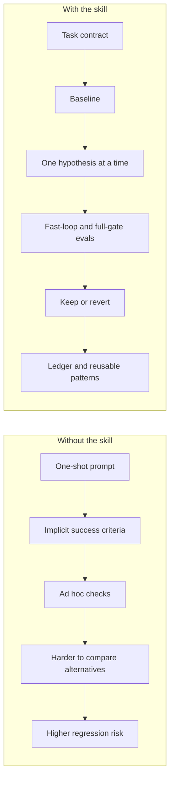
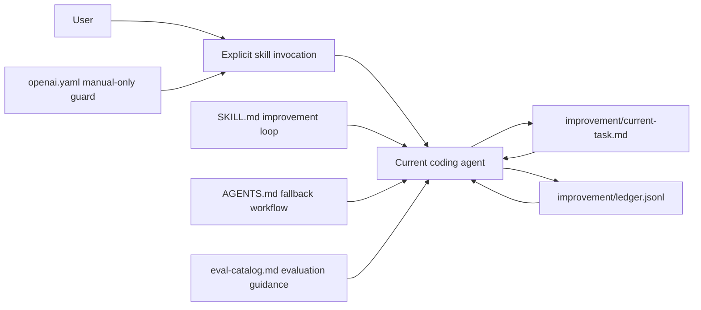
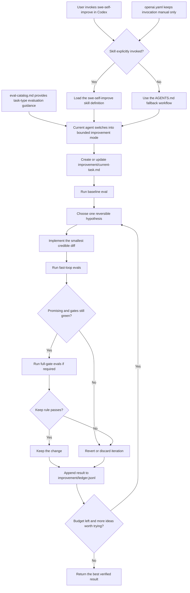

# Universal Self-Improvement Skill System for SWE

If you want coding agents to stop making one-shot guesses and start behaving more like careful engineers, this repo gives you the scaffolding.

A cross-tool starter kit for turning Karpathy-style `autoresearch` into a **general software-engineering improvement loop** with baselines, gates, rollback discipline, and iteration logs.

It works for:

- coding features
- bug fixing
- refactoring
- frontend work
- backend/API work
- model training / ML experiments
- performance work
- build / infra / deployment changes
- data and pipeline tasks

## Why This Repo Is Useful

- It turns agent work from "best effort" into a measured improvement loop
- It works across Codex and Claude Code instead of locking you to one tool
- It reuses the tests, builds, benchmarks, and checks your repository already has
- It leaves behind a task contract and iteration ledger that make agent work easier to review and trust

## Core idea

The transferable part of `autoresearch` is **not** “train an LLM for 5 minutes”.
The transferable part is the loop:

1. define a bounded search space
2. establish a baseline
3. make a short execution plan
4. make one hypothesis-driven change
5. run a deterministic evaluation contract
6. keep or discard the change
7. log the result
8. repeat until the task budget is exhausted

For general SWE, replace the single training metric with a **fitness vector**:

- **hard gates**: build, tests, lint, typecheck, safety, invariants
- **primary metric**: the main thing to optimize for this task
- **secondary metrics**: latency, bundle size, memory, training loss, a11y, simplicity, etc.
- **complexity tax**: do not keep tiny wins that make the code much worse

## The key improvement over the first draft

A single evaluation speed is not universal enough.
For real SWE work you usually need **tiered evaluation**:

- **fast-loop evals**: cheap checks you can run every iteration
- **full gates**: expensive or broad checks you must pass before a change is considered truly kept

Examples:

- Frontend: fast = targeted test + build of touched route; full = full test suite + a11y + visual check
- Backend perf: fast = microbenchmark + targeted tests; full = integration tests + broader perf regression check
- ML: fast = short fixed-budget comparison; full = final evaluation on the real validation budget
- Infra: fast = format + validate + dry-run; full = policy checks + broader rollout review

This makes the loop practical across many task shapes.

## With The Skill vs Without The Skill



| Without the skill | With the skill |
| --- | --- |
| The agent often makes one big guess | The agent works from an explicit task contract |
| Success criteria can stay implicit | Success criteria, gates, and metrics are defined up front |
| Checks tend to be ad hoc or incomplete | Fast-loop evals and full gates are part of the loop |
| It is harder to compare alternatives | Each iteration can be kept or reverted against a baseline |
| Useful context is easy to lose between attempts | The task and results are recorded in `improvement/` artifacts |

## Why this repo is structured this way

Codex and Claude Code have similar skill concepts but different loading mechanisms.
So this kit uses four layers:

1. **Global defaults**
   - `global-templates/codex-home-AGENTS.md` -> copy to `~/.codex/AGENTS.md`
   - `global-templates/claude-home-CLAUDE.md` -> copy to `~/.claude/CLAUDE.md`

2. **Project policy**
   - `AGENTS.md` for Codex
   - `CLAUDE.md` for Claude Code

3. **A shared workflow skill**
   - `.agents/skills/swe-self-improve/` for Codex
   - `.claude/skills/swe-self-improve/` for Claude Code

4. **Persistent improvement artifacts**
   - `improvement/current-task.md`
   - `improvement/ledger.jsonl`
   - `improvement/patterns.md`
   - reusable templates under `improvement/templates/`

## Install

### Global defaults (recommended)

Copy these once on your machine:

- `global-templates/codex-home-AGENTS.md` -> `~/.codex/AGENTS.md`
- `global-templates/claude-home-CLAUDE.md` -> `~/.claude/CLAUDE.md`

These establish reusable personal working agreements across repositories.
Keep them generic.
Keep repository-specific details in each repo.

### Codex project install

Copy these into your repository:

- `AGENTS.md`
- `.agents/skills/swe-self-improve/`
- `improvement/`

Recommended explicit invocation:

```text
$swe-self-improve improve the onboarding flow without increasing bundle size
```

### Claude Code project install

Copy these into your repository:

- `CLAUDE.md`
- `.claude/skills/swe-self-improve/`
- `improvement/`

Recommended explicit invocation:

```text
/swe-self-improve improve the onboarding flow without increasing bundle size
```

## Explicit skill vs always-on workflow

The skill is intentionally configured for **manual invocation**.
That reduces accidental triggering for large or side-effectful workflows.

To avoid a brittle setup, the repository-level `AGENTS.md` and `CLAUDE.md` already encode the same workflow.
So even when the skill is not explicitly invoked, the project still nudges the agent toward the same improvement discipline.

## How The Skill Uses Agents

This repository does **not** define a special multi-agent runtime.
Instead, it changes how the current coding agent operates:

- `.agents/skills/swe-self-improve/SKILL.md` defines the improvement loop
- `AGENTS.md` provides the same workflow as a fallback when the skill is not explicitly invoked
- `.agents/skills/swe-self-improve/agents/openai.yaml` keeps the skill **manual-only** by setting `allow_implicit_invocation: false`
- the agent then writes and updates the persistent artifacts under `improvement/`

Two complementary views help explain it:

### System view



### Iteration flow



### Role map

| Part | Role |
| --- | --- |
| User | Explicitly invokes the skill for a non-trivial SWE task |
| Current coding agent | Executes the loop, makes edits, runs evals, and decides keep vs revert |
| `.agents/skills/swe-self-improve/SKILL.md` | Defines the improvement-loop behavior |
| `AGENTS.md` | Provides the same workflow as a repo-level fallback when the skill is not explicitly invoked |
| `.agents/skills/swe-self-improve/agents/openai.yaml` | Prevents implicit auto-invocation of the skill |
| `references/eval-catalog.md` | Helps the agent choose fast-loop evals, full gates, and metrics by task type |
| `improvement/current-task.md` | Stores the current task contract |
| `improvement/ledger.jsonl` | Stores the baseline and per-iteration keep/revert results |

In other words: the skill does not mainly create new agents; it gives the **current** agent a stricter operating system.
The agent is guided to plan the task, measure a baseline, try one hypothesis at a time, keep or revert changes, and log the outcome in a repeatable way.

## Recommended working model

Use the loop for any non-trivial SWE task.
The workflow should create or update `improvement/current-task.md` with an execution plan before major edits.

Recommended default iteration budget:

- easy bugfix: 1-2 loops
- normal feature/refactor: 2-4 loops
- performance or model tuning: 3-8 loops

## Keep / discard rule

A change is **kept** only when:

1. all hard gates pass
2. the primary metric improves, or stays effectively neutral while simplicity clearly improves
3. no unacceptable regression appears in secondary metrics
4. any required full-gate evaluation also passes

Otherwise revert to the last good checkpoint.

## Example task adapters

### Bug fix
- hard gates: reproduction test, full relevant test suite, lint/typecheck
- primary metric: failing test becomes green
- secondary metrics: no unrelated test regressions, minimal diff

### Frontend
- hard gates: build, lint, typecheck, UI tests/snapshots, a11y checks
- primary metric: acceptance criteria / UX correctness
- secondary metrics: bundle size, Lighthouse/Web Vitals, visual regressions

### Backend/API
- hard gates: unit + integration tests, schema/contract checks, lint/typecheck
- primary metric: correctness for endpoint/business rule
- secondary metrics: p95 latency, allocations, query count, error rate

### Model training / ML
- hard gates: script runs end-to-end, deterministic config, no NaNs/OOMs, result logged
- primary metric: validation metric under fixed budget
- secondary metrics: wall-clock time, VRAM, throughput, simplicity

### Refactor
- hard gates: behavior-lock tests, build, lint/typecheck
- primary metric: behavior preserved
- secondary metrics: file count touched, cyclomatic complexity, duplicated logic, readability

### Infra / deployment
- hard gates: formatter/validator, dry-run/plan, policy/security checks
- primary metric: successful plan or deployment objective
- secondary metrics: blast radius, rollback clarity, config simplicity

### Data / ETL
- hard gates: schema validation, sample run, idempotency checks when needed
- primary metric: correctness/completeness of transformed output
- secondary metrics: runtime, cost, memory, operator burden

## Files you will actually edit over time

The highest leverage files are usually:

- `AGENTS.md`
- `CLAUDE.md`
- `SKILL.md`
- `references/eval-catalog.md`
- `improvement/patterns.md`

That is the generalized version of Karpathy’s “edit the program, not just the code under test”.

## Suggested invocation prompts

```text
$swe-self-improve reduce p95 latency of search without changing the public API
```

```text
$swe-self-improve refactor auth middleware for clarity while preserving behavior
```

```text
/swe-self-improve improve homepage loading performance; do not worsen accessibility or visual stability
```

```text
/swe-self-improve tune this training loop under a fixed 15-minute budget; prefer simpler changes
```

## Self-check included

The `qa/verify_skill_system.py` script performs a lightweight structural review of the kit:

- presence of key files
- invocation flags for Codex and Claude
- Claude line-budget safety
- tiered-eval support in the templates
- universal task coverage across common SWE categories
- presence of global install templates

Run it with:

```bash
python qa/verify_skill_system.py
```

A generated report is also included in `qa/latest-report.md`.

## Pattern recognition helper

The `tools/pattern_recognition.py` script reads `improvement/ledger.jsonl` and turns recurring successful signals into ranked pattern suggestions.
It is designed to help you draft durable entries for `improvement/patterns.md` instead of manually scanning the ledger every time.

Run it with:

```bash
python3 tools/pattern_recognition.py --ledger improvement/ledger.jsonl --format markdown
python3 tools/pattern_recognition.py --ledger improvement/ledger.jsonl --format json
```

Treat the output as a suggestion layer.
Review the proposed patterns before copying anything into `improvement/patterns.md`.

## Ledger contract helper

The `tools/validate_ledger.py` script validates the shape and cross-entry rules of the self-improvement ledger.
Use it after editing `improvement/ledger.jsonl` so the logging contract stays executable instead of drifting into prose-only guidance.

Run it with:

```bash
python3 tools/validate_ledger.py --ledger improvement/ledger.jsonl --format summary
python3 tools/validate_ledger.py --ledger improvement/ledger.jsonl --format json
python3 tools/validate_ledger.py --ledger improvement/templates/ledger-entry.json --single-json --format json
```

That last command validates the shipped example entry in `improvement/templates/ledger-entry.json`, which helps keep the documentation example aligned with the live ledger contract.

## 20-run self-application

If you want to use the skill on this repository itself, treat it like a bounded program instead of an open-ended rewrite.

Recommended approach:

1. define one repository-improvement objective
2. set fast-loop evals and full gates up front
3. log a baseline in `improvement/ledger.jsonl`
4. spend the remaining budget on small reversible hypotheses
5. keep only iterations that improve the support surface without breaking green gates
6. extract durable lessons into `improvement/patterns.md`

This repository's own ledger can be used as a concrete example of that style of self-application.

## Program mode for large sweeps

For a much larger repository-wide push, such as a thorough 600-run sweep across all major areas, use `program mode` instead of one flat queue.

The basic pattern is:

1. scan the repository into areas
2. assign a run budget to each area
3. sweep one area at a time
4. checkpoint between areas
5. keep the current best state as you move through the program

The included planner tool can generate a deterministic starting split:

```bash
python3 tools/repo_area_plan.py --root . --budget 600 --format markdown
python3 tools/repo_area_plan.py --root . --budget 600 --format json
```

That gives you an area coverage plan and a suggested run-budget allocation before you start the actual loop.

## Minimal operating discipline

- baseline first
- one hypothesis per iteration
- smallest reversible diff
- use fast-loop evals every iteration
- use full gates before final keep
- measure before claiming improvement
- log every iteration
- keep only what clearly wins
- stop when the budget is exhausted or the curve flattens
